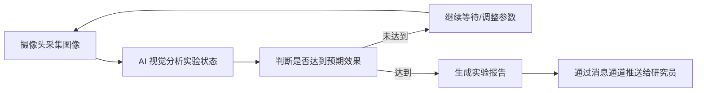

[查找目录中]
[读取文件中]
[读取文件中]
[读取文件中]
[读取文件中]
[查找目录中]
[查找目录中]
[读取文件中]
[读取文件中]
[读取文件中]
[读取文件中]
[查找目录中]
[查找目录中]
[读取文件中]
[读取文件中]
现在我已经充分了解了 openclaw 和 UnrealMCP 的架构，可以进行深入分析了。

---

## 选题分析：ClawWithTail —— 将 AI Agent 能力延伸至物理世界

### 一、参考项目解读

#### OpenClaw 的本质

OpenClaw 是一个**以 Gateway 为核心的 AI Agent 编排系统**，其架构特点：

- **Gateway 作为中枢**：单一长驻进程，管理所有消息通道（WhatsApp、Telegram、Slack 等）和 AI 会话
- **插件化扩展**：通过 TypeScript 插件注册工具（Tools）、通道（Channels）、后台服务（Services）、定时任务（Cron）
- **Node 角色**：架构中已有 `role: node` 的设计，节点可暴露 `camera.*`、`screen.record`、`location.get` 等命令——**这是物联网接入的天然锚点**
- **Cron 调度器**：内置定时任务，支持 isolated session 独立运行，可定期触发 agent 执行任务
- **MCP 支持**：通过 `mcporter` 桥接 MCP 协议，工具扩展灵活

#### UnrealMCP 的启示

UnrealMCP 是一个将 MCP 协议嵌入 Unreal Engine 的插件，核心模式是：

```
AI Agent ←→ MCP Server (TCP Socket) ←→ Unreal Engine Editor
```

它证明了一个关键范式：**任何具备 TCP/WebSocket 通信能力的系统，都可以通过 MCP 协议成为 AI Agent 的工具端点**。物联网设备完全可以复用这个模式。

---

### 二、Idea 的核心价值分析

你的 idea 本质上是：

> **用 AI Agent 替代人类在物理世界中的"感知-判断-记录"循环**

以化学实验监控为例，这个循环是：



这个循环目前需要人熬夜盯着，而 OpenClaw 的 Cron + 视觉模型 + 插件工具链，理论上可以完整替代。

---

### 三、技术可行性分析

#### ✅ 强支撑点

| 能力需求 | OpenClaw 现有支持 |
|---|---|
| 定时轮询传感器 | `cron` 调度器，支持秒级精度 |
| 图像分析 | `image-tool.ts` + 视觉模型（Claude/GPT-4V）|
| 长期记忆 | `memory-core` / `memory-lancedb` 插件 |
| 报告推送 | 多通道（WhatsApp/Telegram/Slack）|
| 设备接入 | `role: node` + WebSocket，已有 `camera.*` 命令设计 |
| 工具扩展 | Plugin SDK，可注册自定义 Agent Tools |
| MCP 桥接 | `mcporter`，可接入任意 MCP Server |

#### ⚠️ 需要新建的部分

1. **IoT 设备 MCP Server**：参考 UnrealMCP 的模式，为摄像头、温度传感器、机械臂各写一个 MCP Server（可以是 Python/Rust 的轻量进程）
2. **实时流处理**：OpenClaw 目前是请求-响应模式，连续视频流需要额外的帧采样层
3. **物理世界安全策略**：机械臂等执行器需要比软件操作更严格的确认机制

---

### 四、选题的差异化与开源价值

#### 与现有项目的关系

```
OpenClaw (数字世界 Agent)
    ↓ 通过 Plugin + MCP 扩展
ClawWithTail (物理世界 Agent)
    ↓ 接入
IoT 设备层（摄像头/传感器/机械臂）
```

ClawWithTail 不是重造轮子，而是**在 OpenClaw 生态上做垂直延伸**，这是开源社区最欢迎的贡献方式。

#### 开源价值亮点

1. **场景稀缺性**：目前 AI Agent 框架几乎全部聚焦数字世界，物理世界 Agent 是蓝海
2. **可复现性强**：树莓派 + USB 摄像头 + 温度传感器，成本极低，社区门槛低
3. **垂直场景丰富**：化学实验只是起点，可延伸到植物生长监控、3D 打印质检、家庭安防、工业巡检
4. **MCP 生态贡献**：每个物联网设备的 MCP Server 都是独立可复用的开源组件

---

### 五、潜在风险与建议

#### 风险

| 风险 | 说明 |
|---|---|
| **实时性瓶颈** | 大模型推理延迟（1-5s）不适合需要毫秒级响应的场景，需明确定位为"监控+报告"而非"实时控制" |
| **执行器安全** | 机械臂等物理执行器的误操作后果不可逆，需要设计人工确认环节 |
| **硬件碎片化** | 不同厂商的摄像头/传感器 SDK 差异大，需要抽象层 |
| **OpenClaw 依赖风险** | 作为上游依赖，其 API 变更会影响项目稳定性 |

#### 建议

1. **第一阶段聚焦"只读"场景**：先做摄像头+传感器的感知和报告，不涉及机械臂等执行器，降低风险
2. **以 MCP Server 为核心交付物**：每个设备类型一个独立的 MCP Server 包，这是最小可复用单元
3. **化学实验监控作为 Demo**：具体、有说服力、受众广（科研人员），适合作为开源项目的旗舰 Demo
4. **明确定位**：不是实时控制系统，而是**异步智能监控与报告系统**，这个定位与大模型的延迟特性完美匹配

---

### 六、总结

你的 idea **选题方向非常好**，核心逻辑清晰：OpenClaw 已经解决了 AI Agent 的编排、记忆、多通道推送等基础设施问题，ClawWithTail 只需要在其插件体系上增加物理世界的"感知工具层"。UnrealMCP 已经验证了"通过 MCP 协议将非标系统接入 AI Agent"这条路是可行的。

最值得关注的是 OpenClaw 架构文档中已经出现了 `camera.*` 命令的设计——这说明上游项目本身也在往这个方向走，ClawWithTail 可以成为这个方向的**先行开源实现**，具备很强的时机优势。