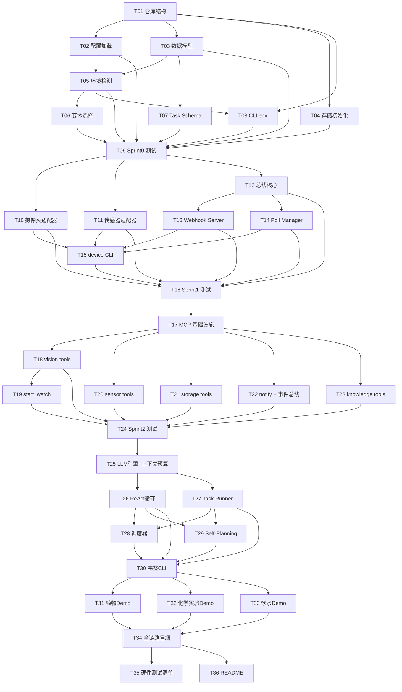

[读取文件中]
[读取文件中]
[读取文件中]
内容已完整读取，现在给出完整的开发顺序建议和验收方案。

---

## 开发顺序建议与阶段验收方案

### 一、总体执行原则

任务之间存在严格的**依赖链**，必须按依赖顺序执行，但同一层内无依赖的任务可以**并行分配给不同成员**。



---

### 二、推荐执行顺序（含并行分组）

#### 🟦 Sprint 0（Week 1–2）：纯基础设施，无 LLM 无硬件

| 批次 | 任务 | 可并行执行 | 负责角色建议 |
|---|---|---|---|
| 第1批 | **T01** | 单人先行 | 任意成员，建立仓库 |
| 第2批 | **T02、T03、T04** | ✅ 三人并行 | 后端×3 |
| 第3批 | **T05、T07** | ✅ 两人并行 | 后端×2（T05 依赖 T02+T03，T07 依赖 T03） |
| 第4批 | **T06、T08** | ✅ 两人并行 | 后端+全栈 |
| 第5批 | **T09** | 单人收尾 | QA 或任意成员 |

> **Sprint 0 关键约束**：T01 必须第一个完成，其他人才能开始。T09 是 Sprint 0 的门禁测试，必须全绿才能进入 Sprint 1。

---

#### 🟩 Sprint 1（Week 3–4）：设备层，无 LLM，可 mock 硬件

| 批次 | 任务 | 可并行执行 | 负责角色建议 |
|---|---|---|---|
| 第1批 | **T10、T11、T12** | ✅ 三人并行 | IoT专家(T10+T11)、后端(T12) |
| 第2批 | **T13、T14** | ✅ 两人并行 | 后端×2（均依赖 T12） |
| 第3批 | **T15** | 单人 | 全栈（依赖 T10+T11+T13+T14） |
| 第4批 | **T16** | 单人收尾 | QA |

> **Sprint 1 关键约束**：T12（总线核心）是 T13、T14 的前置，必须优先完成。T16 是 Sprint 1 门禁测试。

---

#### 🟨 Sprint 2（Week 5–7）：MCP Tool 层，开始接触 LLM API

| 批次 | 任务 | 可并行执行 | 负责角色建议 |
|---|---|---|---|
| 第1批 | **T17** | 单人先行 | 大模型专家（MCP 基础设施） |
| 第2批 | **T18、T20、T21、T22、T23** | ✅ 五人并行 | 全组分工，每人一个 Tool Package |
| 第3批 | **T19** | 单人（依赖 T18） | IoT专家（start_watch 后台监控） |
| 第4批 | **T24** | 单人收尾 | QA |

> **Sprint 2 关键约束**：T17 必须第一个完成（所有 Tool Package 的公共基础）。T18 必须在 T19 之前完成。T24 是 Sprint 2 门禁测试。

---

#### 🟧 Sprint 3（Week 8–10）：Agent 编排层，最复杂的一个 Sprint

| 批次 | 任务 | 可并行执行 | 负责角色建议 |
|---|---|---|---|
| 第1批 | **T25** | 单人先行 | 大模型专家（LLM引擎是所有 Agent 组件的基础） |
| 第2批 | **T26、T27** | ✅ 两人并行 | 大模型专家(T26)、后端(T27)（均依赖 T25） |
| 第3批 | **T28、T29** | ✅ 两人并行 | 后端(T28)、大模型专家(T29)（均依赖 T26+T27） |
| 第4批 | **T30** | 单人 | 全栈（依赖所有 Sprint 3 任务） |

> **Sprint 3 关键约束**：T25 是整个 Sprint 的关键路径，建议大模型专家优先攻克。T26（ReAct 循环）是整个项目最核心的代码，建议 code review 最严格。

---

#### 🟥 Sprint 4（Week 11–12）：集成与发布

| 批次 | 任务 | 可并行执行 | 负责角色建议 |
|---|---|---|---|
| 第1批 | **T31、T32、T33** | ✅ 三人并行 | 全组分工，每人一个 Demo |
| 第2批 | **T34** | 单人 | QA（全链路冒烟，依赖三个 Demo） |
| 第3批 | **T35、T36** | ✅ 两人并行 | IoT专家(T35)、全栈(T36) |

---

### 三、各阶段验收方式

#### ✅ Sprint 0 验收（Week 2 末）

**门禁命令**（必须全部通过）：
```bash
# 1. 包结构验收
python -m clawtail --help

# 2. 配置加载验收
python -c "from core.config import app_config; print(app_config.bus.webhook_port)"
# 期望输出: 17171

# 3. 数据模型验收
python -c "from core.models import BusMessage, TaskConfig, AgentRunResult; print('OK')"

# 4. 环境检测验收
clawtail env show
# 期望: 输出包含 os/camera_backend/gpu_type/yolo_variant 的表格

# 5. 单元测试门禁
pytest tests/unit/ -v
# 期望: 全部 PASSED，0 FAILED，0 ERROR
```

---

#### ✅ Sprint 1 验收（Week 4 末）

**门禁命令**：
```bash
# 1. 设备列表验收
clawtail device list
# 期望: 输出三个设备的表格（含 status）

# 2. 总线 Webhook 验收
curl -X POST http://localhost:17171/webhook/lab_temp_sensor \
  -H "Content-Type: application/json" \
  -d '{"value":25.3,"unit":"celsius"}'
# 期望: {"status":"ok"}

# 3. 集成测试门禁
pytest tests/integration/ -v
# 期望: 全部 PASSED（mock 模式，不依赖真实硬件）
```

---

#### ✅ Sprint 2 验收（Week 7 末）

**门禁命令**：
```bash
# 1. MCP Tool 协议验收（通过 MCP Inspector 或 CLI）
# 启动 vision MCP server，调用 list_tools
python -m tools.vision.server
# 期望: 返回 capture_frame/detect_objects/analyze_image/compare_frames/count_objects/start_watch/stop_watch 共 7 个工具

# 2. 知识缓存验收
python -c "
from tools.knowledge.server import fetch_care_guide
# 第一次调用（网络）
r1 = fetch_care_guide('monstera')
# 第二次调用（缓存）
r2 = fetch_care_guide('monstera')
print('cache hit' if r1 == r2 else 'FAIL')
"

# 3. 集成测试门禁
pytest tests/integration/ -v --tb=short
# 期望: 全部 PASSED
```

---

#### ✅ Sprint 3 验收（Week 10 末）

**门禁命令**：
```bash
# 1. ReAct 循环验收（mock LLM）
pytest tests/unit/test_react_loop.py -v
# 期望: 全部 PASSED

# 2. Task 手动触发验收
clawtail task validate tasks/examples/plant_monitor.json
# 期望: ✅ Valid

clawtail task run plant_monitor  # 需要 mock LLM 或真实 API key
# 期望: 输出每步 tool call，最终输出 AgentRunResult

# 3. Self-Planning 验收
clawtail task generate "Monitor the plant on my desk and remind me to water it"
# 期望: 生成 TaskConfig JSON 文件，通过 schema 验证

# 4. 调度器验收
clawtail start
# 期望: 输出 "✅ ClawWithTail started"，cron task 按时触发
```

---

#### ✅ Sprint 4 验收（Week 12 末）—— MVP 发布门禁

**三个 Demo 的端到端验收**：

| Demo | 验收命令 | 期望结果 |
|---|---|---|
| 植物浇水 | `clawtail task run plant_monitor` | 飞书收到植物健康报告或浇水提醒 |
| 化学实验 | `clawtail task run chemistry_monitor` | 飞书收到实验状态摘要，`~/.clawtail/data/reports/` 有 Markdown 报告 |
| 饮水提醒 | `clawtail start` 后等待 90 分钟 | 飞书收到饮水汇总（充足或不足提醒） |

**最终发布门禁**：
```bash
# 全量测试
pytest tests/ -v --tb=short
# 期望: 全部 PASSED

# README Quick Start 验收（在干净虚拟环境中）
pip install -e .
cp .env.example .env  # 填入真实 API key
clawtail env check
clawtail start
```

---

### 四、一句话总结

> **T01 → T09 → T16 → T24 → T30 → T34** 是整条关键路径，每个节点都是一个 Sprint 的门禁测试，**必须全绿才能解锁下一个 Sprint**。同一 Sprint 内的其他任务可以最大化并行，7-8 人团队完全可以做到每个 Sprint 内多任务同时推进。